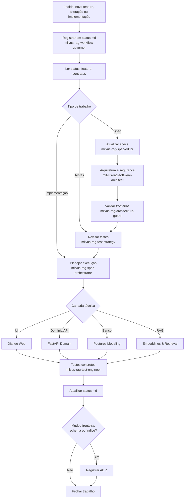

# Guia Rápido: Workflow de IA com Specs (Milvus RAG POC)

## Objetivo

Usar as specs e as skills do Claude Code para evoluir a POC de RAG sem perder memória, sem misturar camadas e sem refazer áreas não impactadas. Metodologia enxuta para POC.

## Ordem de trabalho

1. Registrar/atualizar trabalho em `docs/specs/state/status.md` quando a mudança tocar mais de um documento.
2. Ler a visão funcional em [../specs/product/overview.md](../specs/product/overview.md).
3. Ler a feature em `docs/specs/features/`.
4. Revisar contratos em `docs/specs/contracts/`.
5. Passar por arquitetura/segurança com `milvus-rag-software-architect` quando relevante.
6. Validar fronteiras com `milvus-rag-architecture-guard`.
7. Revisar testes esperados em `docs/specs/testing/`.
8. Implementar e testar (`milvus-rag-*` técnica + `milvus-rag-test-engineer`).
9. Atualizar `status.md` (status + changelog) e, se necessário, registrar ADR.

Índice das skills: [../../.claude/skills/README.md](../../.claude/skills/README.md).

## Quando usar cada skill

- `milvus-rag-workflow-governor`: coordenar mudança multi-documento, retomar, bloquear, concluir, reverter
- `milvus-rag-spec-editor`: criar/alterar specs
- `milvus-rag-spec-orchestrator`: conduzir/retomar implementação a partir das specs
- `milvus-rag-software-architect`: arquitetura, segurança, decisões técnicas
- `milvus-rag-architecture-guard`: validar fronteiras entre camadas
- `milvus-rag-test-strategy`: aceite, cobertura, avaliação de retrieval, regressão
- `milvus-rag-test-engineer`: testes executáveis e evidência
- `milvus-rag-fastapi-domain`: domínio e API (ingestão, retrieval, endpoints)
- `milvus-rag-postgres-modeling`: documentos, chunks, jobs, metadados
- `milvus-rag-django-web`: UI de upload, metadados e consulta
- `milvus-rag-embeddings-retrieval`: chunking, embeddings, Milvus, retrieval, avaliação

## Fluxo de uma mudança



Regra de ouro: quando o trabalho cruzar mais de um documento, comece registrando em `status.md` e termine validando os critérios de aceite.

## Exemplos rápidos

### Criar/ajustar a spec de ingestão

```text
Use milvus-rag-workflow-governor e milvus-rag-spec-editor para detalhar a spec de ingestão (FEAT-INGEST-001): chunking, embeddings, indexação, contratos e testes esperados.
```

### Definir o contrato do índice vetorial

```text
Use milvus-rag-software-architect e milvus-rag-embeddings-retrieval para fixar modelo de embeddings, dimensão e métrica no vector-index.md, registrando ADR.
```

### Implementar upload + metadados no Django

```text
Use milvus-rag-django-web para implementar a tela de upload e metadados da FEAT-UPLOAD-001, respeitando o contrato upload-and-metadata.
```

### Implementar consulta com citações no FastAPI

```text
Use milvus-rag-fastapi-domain e milvus-rag-embeddings-retrieval para implementar POST /query da FEAT-QUERY-001 com retrieval top-k e resposta com citações.
```

## Checklists curtos

### Antes de codar
- a feature existe e está atualizada
- os contratos afetados estão claros
- arquitetura/fronteiras revisadas quando aplicável
- a camada responsável está definida
- os testes esperados estão declarados

### Depois de codar
- `status.md` atualizado (status + changelog)
- testes executados ou pendência registrada
- ADR registrado se mudou fronteira, schema ou índice
